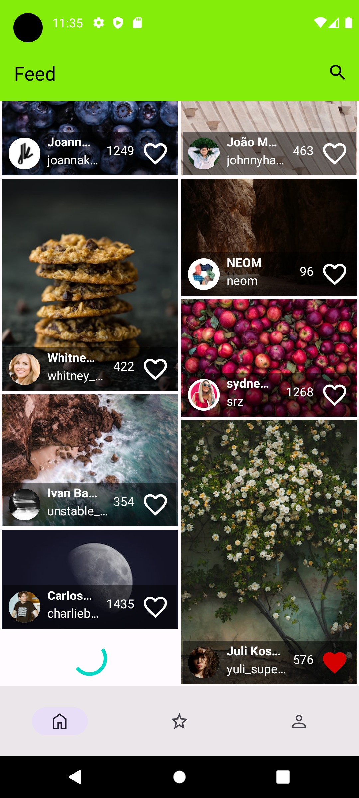
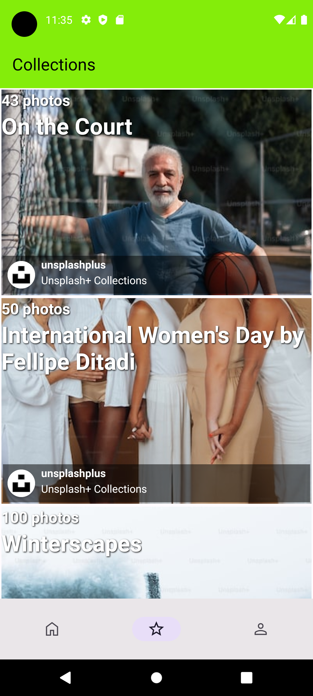
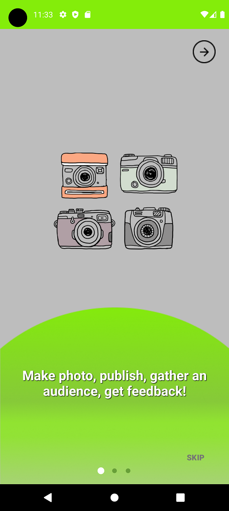
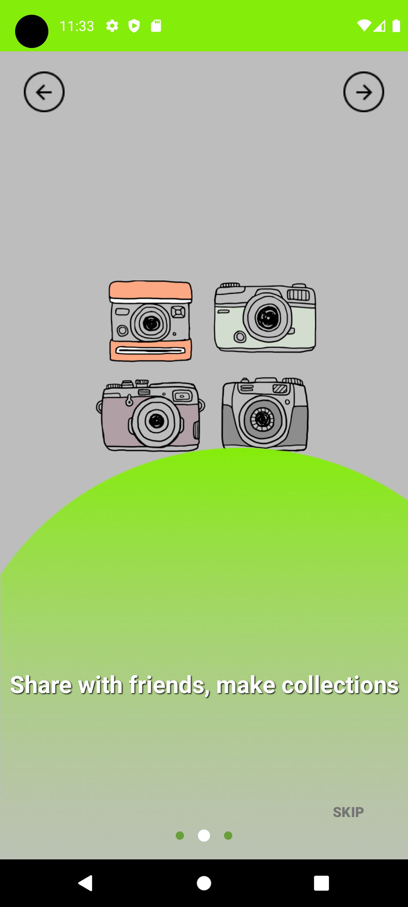
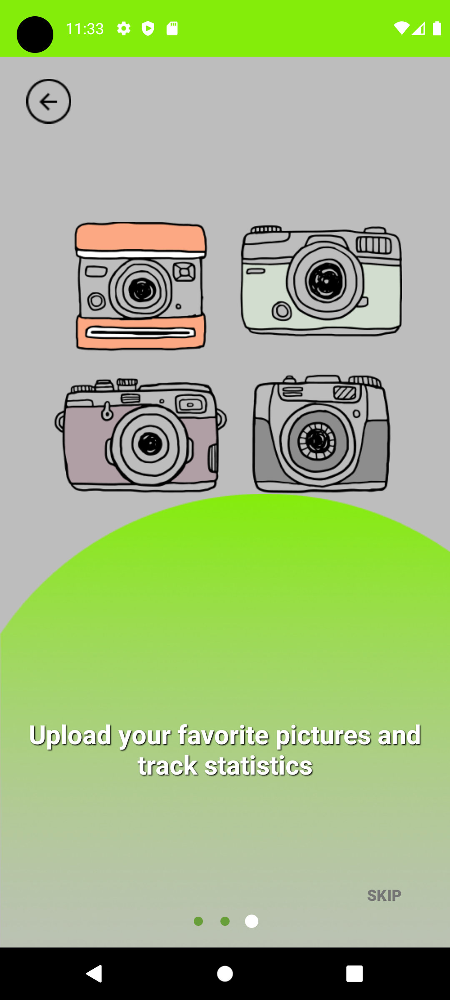

# Unsplash
Photos from  Unsplash API. Users can authorize and view their favorite photos. 

## Built With
1. Kotlin
2. XML
3. MVVM - Single Activity Architecture
4. Coroutines
5. Flow - StateFlow
6. Hilt
7. Retrofit 2
8. Picasso
9. Paging
10. Room
11. Recyclerview
12. OAuth

## Preview
### Authorization

Main screen

Collections

Onboarding

